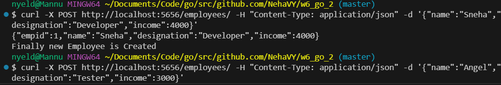
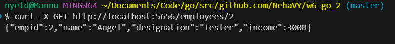
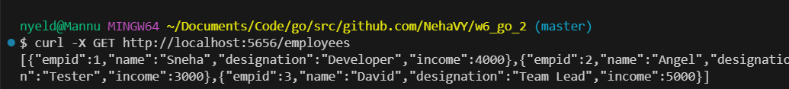
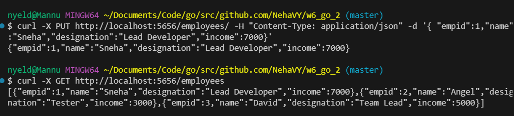
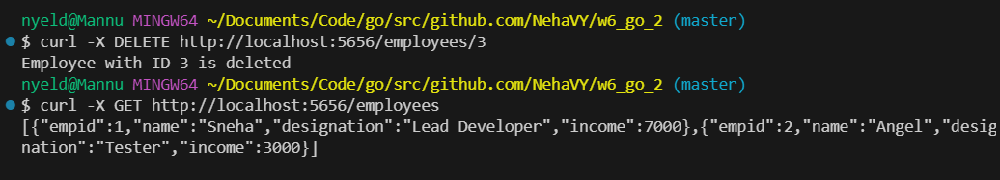

# Employee Management API

This project is a simple REST API built using Go that allows you to manage employee records. You can create, read, update, and delete employee data through basic API requests. This is perfect for learning how to perform basic CRUD (Create, Read, Update, Delete) operations using Go.

## Features

- **Get All Employees**: View a list of all employees.

- **Get Employee by ID**: Retrieve details of a specific employee using their ID.
- **Create Employee**: Add new employees with details such as name, designation,and income.
- **Update Employee**: Modify the details of an existing employee.
- **Delete Employee**: Remove an employee from the system.

**Start the Server**

**Adding employees**

**Get employee by ID**

**Get all Employees**

**Update an exsisting employee**

**Delete an Employee by id**

